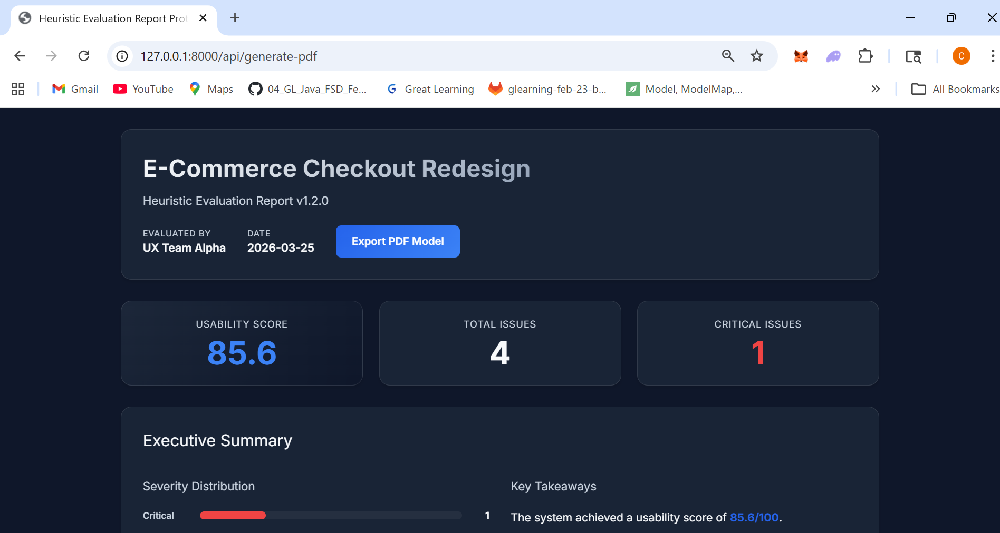
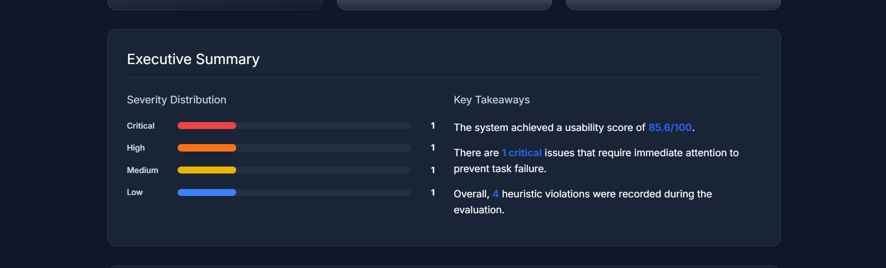
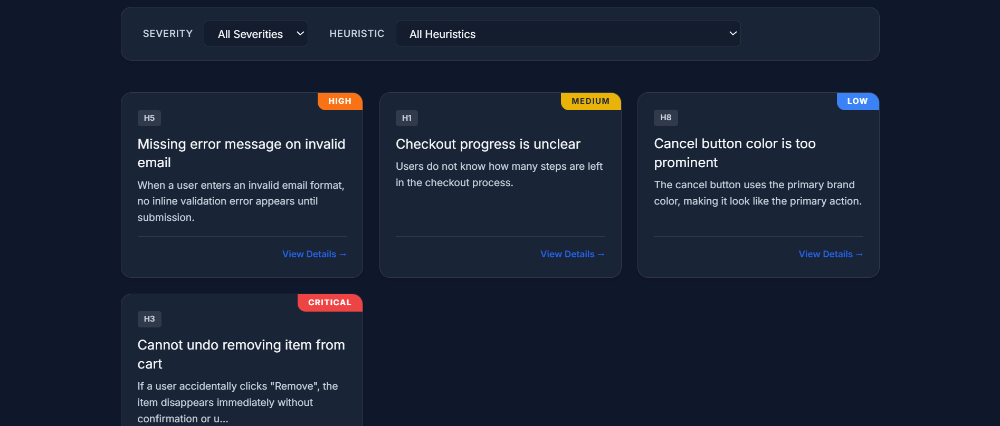
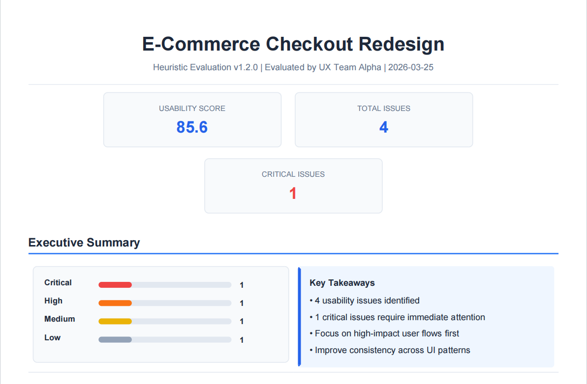
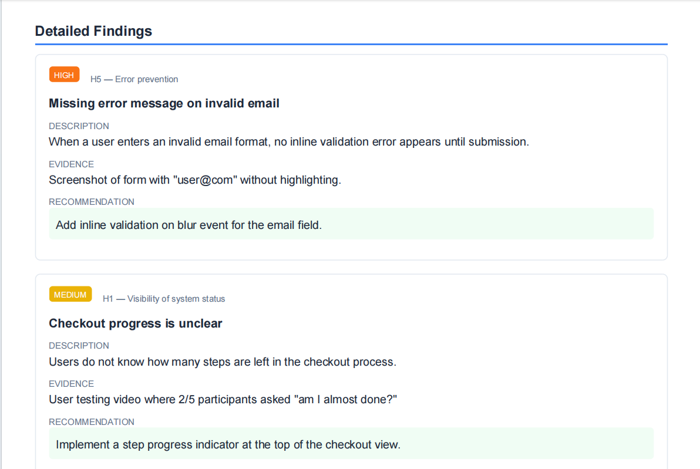

# Heuristic Evaluation Report Layout Improvements

This prototype redesigns the **RUXAILAB heuristic evaluation report** to improve readability, structure, and usability across both **UI view and exported PDF**.

The goal is to make evaluation results easier to scan, understand, and act upon.

---

# Problem

The existing heuristic evaluation report:

- lacks clear hierarchy  
- difficult to scan findings  
- no visual summary  
- poor severity emphasis  
- inconsistent PDF export layout  
- limited readability for stakeholders  

---

# Solution

This prototype introduces a **structured report layout** with:

- Visual summary cards  
- Executive summary with severity distribution  
- Key takeaways panel  
- Structured finding cards  
- Severity highlighting  
- Appendix data table  
- UI and PDF layout consistency  

---

# Features

### Summary Overview

- Usability Score  
- Total Issues  
- Critical Issues  

### Executive Summary

- Severity distribution bars  
- Key takeaways panel  
- Balanced two-column layout  

### Finding Cards

Each issue displayed as structured card:

- Severity badge  
- Heuristic reference  
- Title  
- Description  
- Evidence  
- Recommendation  

### Visual Severity Distribution

- Critical  
- High  
- Medium  
- Low  

### Appendix Table

Raw structured findings list for reference.

---

# Preview

## UI Layout

### Header & Summary


### Executive Summary


### Findings Cards


---

## PDF Export

### Header & Summary


### Executive Summary


### Findings Cards


---

# Tech Stack

- Laravel Blade  
- HTML/CSS  
- DOMPDF  
- PHP  

---

# File Structure
report.blade.php # Report layout
Controller # Generates report data
PDF Export # DOMPDF render
```
screenshots/
├── ui/
│ ├── ui-header.png
│ ├── ui-exec-summary.png
│ └── ui-findings.png
  └── ui-insights.png
  └── ui-appendix.png
│
└── pdf/
├── pdf-header.png
├── pdf-findings.png
└── pdf-appendix.png
```

---

# How to Generate Report

Render Blade view:
return view('report', compact('report'));


Generate PDF:


PDF::loadView('report', $data)->download();


---

# GSoC Idea Alignment

This prototype addresses:

- Report Information Architecture  
- Visual Summary Components  
- Finding Cards & Severity Emphasis  
- Navigation-ready layout  
- Export Consistency (UI + PDF)  

---

# Future Improvements

- collapsible findings  
- filtering by severity  
- heuristic grouping  
- interactive navigation  
- clickable table of contents  
- multi-evaluator support  

---

# Author

Chanchal Kumari  
Prototype for GSoC — RUXAILAB  
Heuristic Evaluation Report Layout Improvements